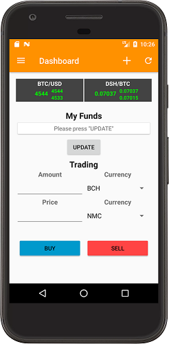
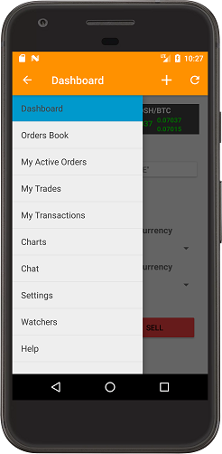
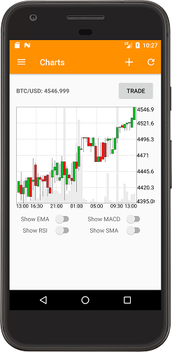

# WEX (ex BTC-e) client for Android

Say "hello" to a new mobile client for WEX (ex. BTC-e) exchange! Completely free and lightweight
 app! App is using API keys (required only for **Trading**, **Account info** and **History**) – it's completely
  safe, since they have no withdrawal functionality. No login/pass required.

* Automatic sync with set of trading instruments available on exchange
* Straightforward and configurable **Dashboard** where you can watch the latest prices all at once
* **Trading** section inside **Dashboard**: simply tap on any price and necessary fields will be populated automatically
* Watchers mechanism: you are able to add watching rules and you will be notified on **Stop Loss**, **Take Profit**, **Panic Buy** or **Panic Sell** for particular pair
* Charts section: you can enable different market indicators - **MACD**, **EMA**, **SMA**, **RSI**
* You can update prices manually or by a recurrent check: you are free to choose how often to check
* Watch your **Active Orders**/**Transactions**/**Trades** inside the app
* Price widgets – simply touch to update
* **Dashboard** built with card view. Switch between sides with long click.
* Automatic sync with set of trading instruments available on exchange
* Chat support (read-only)

Play Store link: https://play.google.com/store/apps/details?id=com.QuarkLabs.BTCeClient

## Screenshots

## Libraries

App is using minimum set of libraries for transparency reason.

* StockChartView (http://stockchartview.org)
* GSON (https://github.com/google/gson)
* jsoup (https://jsoup.org)

## Build

Simply clone this repo, open project in *Android Studio* and run the following command:

    ./gradlew assembleDebug
    
There are come checks embedded in the build process: `checkstyle`, `pmd`, `findbugs`.
You can run individually (by running corresponding task), or as a part of `check` task (with unit-tests):

    ./gradlew check

## License

    This program is free software: you can redistribute it and/or modify
    it under the terms of the GNU General Public License as published by
    the Free Software Foundation, either version 3 of the License, or
    (at your option) any later version.

    This program is distributed in the hope that it will be useful,
    but WITHOUT ANY WARRANTY; without even the implied warranty of
    MERCHANTABILITY or FITNESS FOR A PARTICULAR PURPOSE.  See the
    GNU General Public License for more details.

    You should have received a copy of the GNU General Public License
    along with this program.  If not, see <http://www.gnu.org/licenses/>.
